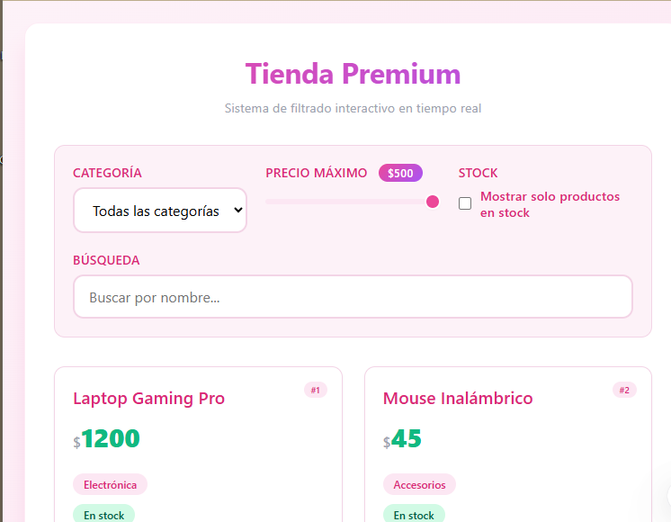
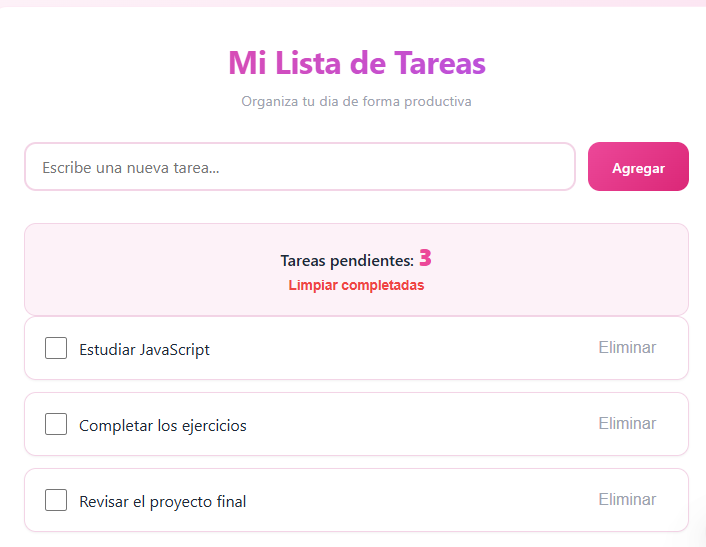
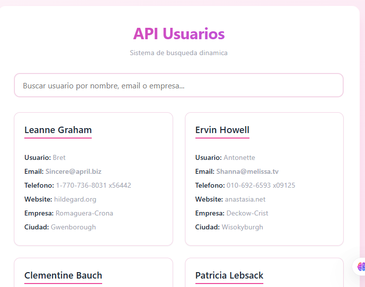

# TP2-PRACTICAS 
### Aplicaciones JavaScript ES6+
http://127.0.0.1:5500/productos.html
http://127.0.0.1:5500/todo.html
http://127.0.0.1:5500/api-demo.html

## Descripción del Proyecto
**JS Mini Apps** es un conjunto de tres aplicaciones web interactivas desarrolladas con **JavaScript ES6+**, **HTML5** y **CSS3**. Cada una implementa distintos conceptos clave del desarrollo frontend moderno, incluyendo manipulación del DOM, eventos, programación asincrónica y consumo de APIs.
https://daniicamacho27.github.io/TP2_PRACTICAS/

## Diseño
1. Paleta de colores
2. Uso de gradientes suaves y sombras
3. Diseño completamente responsive

## Páginas del Proyecto
1. Sistema de productos: Se desarrolló un catálogo de productos dinámico que permite visualizar, filtrar y ordenar artículos en tiempo real. La aplicación utiliza métodos como .map(), .filter() y .sort() para gestionar los datos y actualizar la interfaz sin recargar la página.
Funcionalidades:
1. Renderizado de 12 productos en tarjetas con .map()
2. Filtro por categoría mediante <select>
3. Filtro por precio máximo con <input type="range">
4. Filtro por stock con checkbox
5. Búsqueda por nombre en tiempo real
6. Aplicación de filtros combinados
Productos incluidos:
* Laptop Gaming
* Mouse Inalámbrico
* Teclado Mecánico
* Monitor 4K
* Silla Ergonómica
* Auriculares ANC
* Webcam 4K
* Escritorio Premium
* SSD 1TB
* Mousepad XXL
* Micrófono USB
* Lámpara LED

2. Lista de Tareas (To-Do): Aplicación interactiva que permite gestionar tareas diarias de forma dinámica, sin recargar la página.
Funcionalidades:
1. Agregar tareas con validación (preventDefault)
2. Crear elementos dinámicamente con createElement()
3. Marcar tareas como completadas con classList.toggle()
4. Eliminar tareas individuales con .remove()
5. Contador dinámico de tareas pendientes
6. Eliminación de tareas completadas

3. API Usuarios: Aplicación que consume una API pública para mostrar información de usuarios en tiempo real.
API utilizada:
JSONPlaceholder (endpoint de usuarios)
Funcionalidades:
1. Consumo de API con fetch() y async/await
2. Validación de response.ok
3. Manejo de errores con try/catch
4. Estado de carga ("Cargando...")
5. Renderizado dinámico con .map()
6. Mensaje de error en caso de fallo
7. Búsqueda dinámica:
 * Mínimo 3 caracteres
 * Estado "Buscando..."
 * Filtrado local con .filter()
 * Mensaje si no hay resultados

## Tecnologías Usadas
El proyecto fue desarrollado utilizando HTML5 para la estructura, CSS3 para el diseño responsive y JavaScript ES6+ para la lógica.
Se utilizaron métodos de arrays como .map(), .filter(), .reduce() y .find(), junto con la Fetch API para consumir datos externos y eventos como click, input y submit para lograr interacción en tiempo real.

## Capturas 
1. Sistema de productos

2. Lista de tareas

3. API Usuarios 

## Instrucciones de uso
1. Clonar el repositorio
2. Abrir en Visual Studio Code
3. Ejecutar con Live Server
4. Navegar entre las páginas

## Conclusión
“Proyecto desarrollado como trabajo práctico integrador de la Unidad 2 — Programador Junior.”

